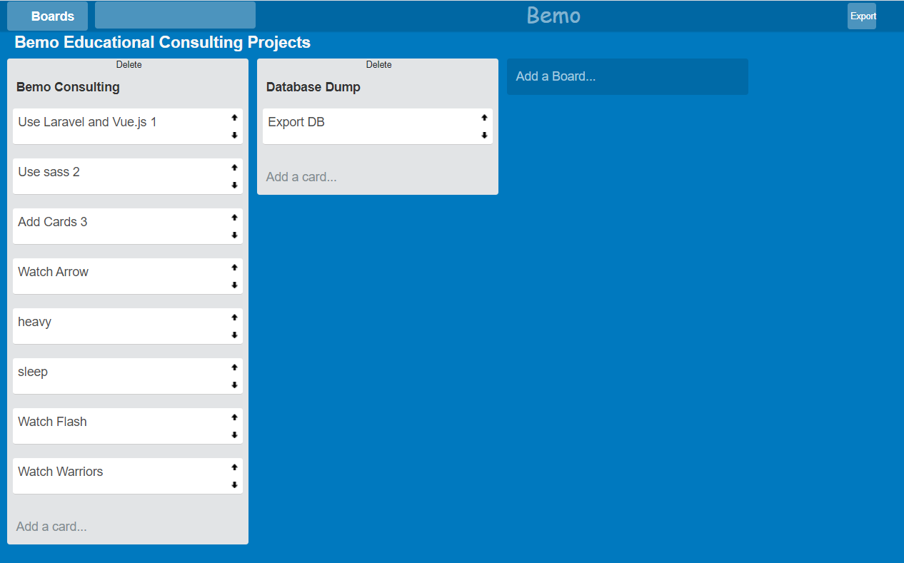

# Vue.js and laravel Trello Clone App

Run
```
$ npm install
$ npm install vue-router
$ create database and add settings to .env and then run "php artisan migrate"
$ php artisan serve
```
<h2 id="screenshots">Screenshot</h2>




